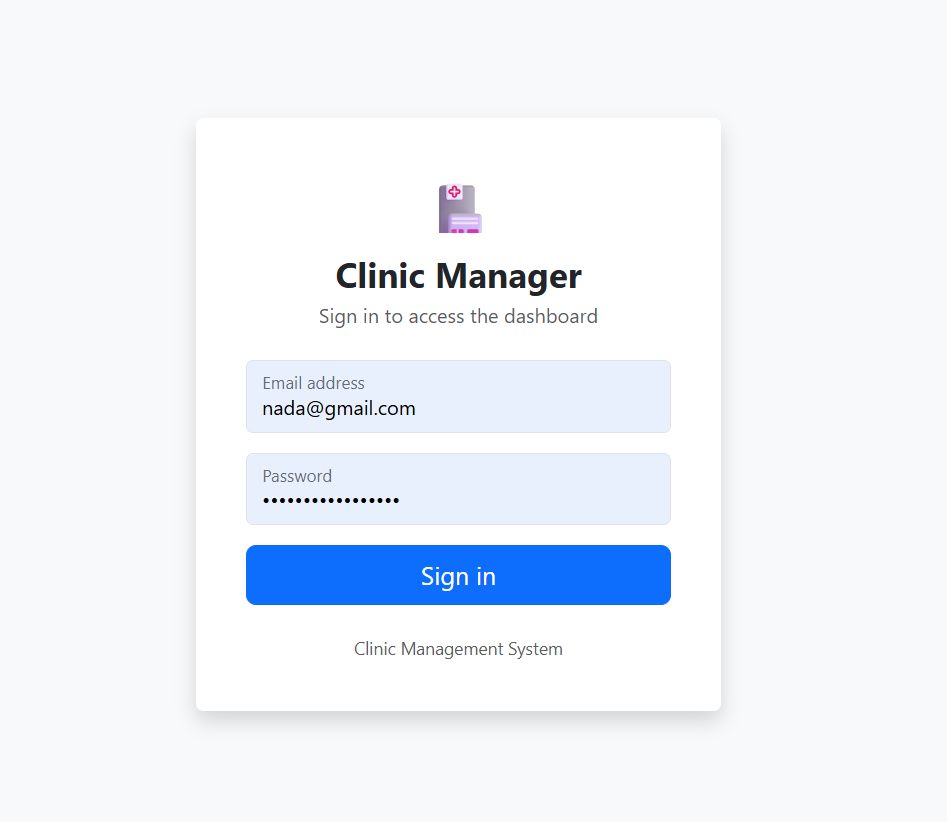
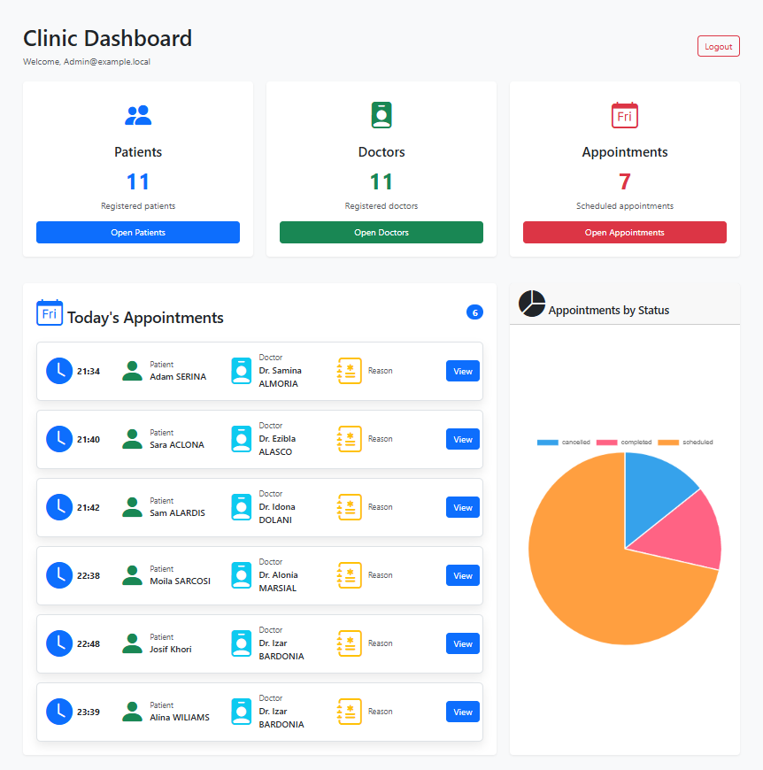
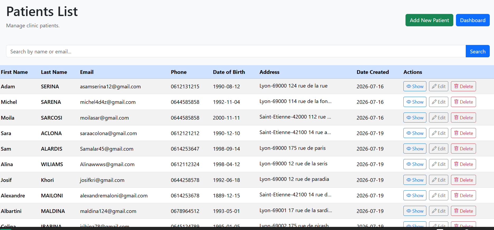
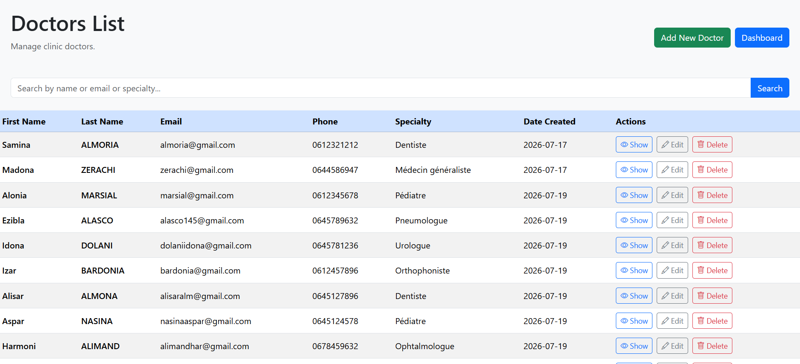
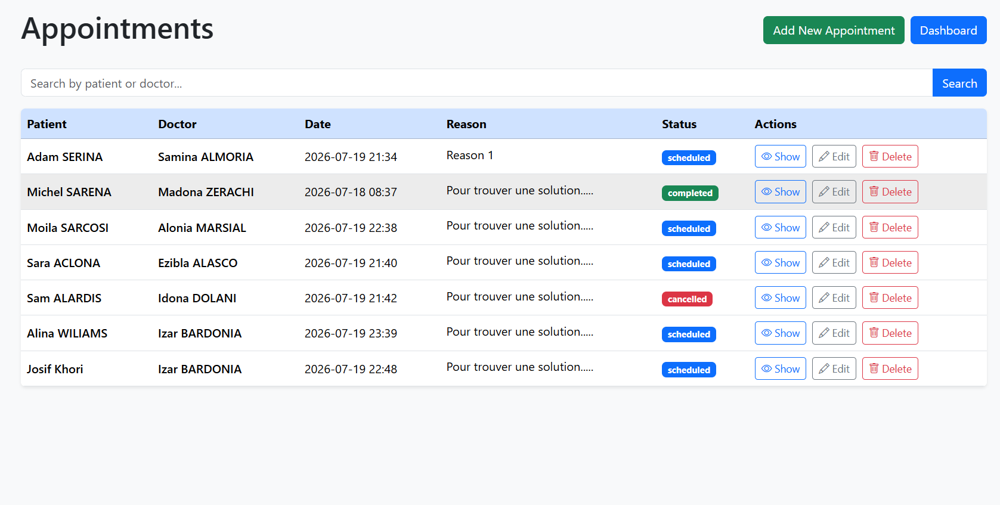

# 🏥 Clinic Manager

A modern clinic management system built with Symfony 8.

This application allows users to manage patients, doctors, and appointments through a secure and user-friendly interface.

## 📖 About

Clinic Manager is a web application designed to simplify clinic administration.

The application provides a secure environment where authenticated users can:

- Manage patients.
- Manage doctors.
- Schedule appointments.
- Prevent appointment conflicts.
- View statistics through an interactive dashboard.

This project was developed using Symfony 8 to demonstrate my backend development skills and best practices in web application development.

## ✨ Features

- 🔐 Secure authentication system
- 📊 Dashboard with clinic statistics
- 👨‍⚕️ Doctor management (Create, Read, Update, Delete)
- 🧑‍🤝‍🧑 Patient management (Create, Read, Update, Delete)
- 📅 Appointment management (Create, Read, Update, Delete)
- 🚫 Appointment conflict detection
- 🔍 Search functionality
- 📄 Pagination
- 📈 Interactive appointment status chart with Chart.js
- 📱 Responsive design with Bootstrap 5
- 🛡️ CSRF protection for forms

## 🛠️ Technologies

### Backend
- PHP 8.5
- Symfony 8
- Doctrine ORM

### Frontend
- Twig
- Bootstrap 5
- JavaScript
- Chart.js

### Database
- MySQL

### Tools
- Git
- GitHub
- Composer
- Symfony CLI
- VS Code


## 📸 Screenshots

### Login



---

### Dashboard



---

### Patients



---

### Doctors



---

### Appointments



## 🚀 Installation

1. Clone the repository

```bash
git clone https://github.com/Maan625/clinic-manager.git
```

2. Navigate to the project

```bash
cd clinic-manager
```

3. Install dependencies

```bash
composer install
```

4. Configure your `.env` file and database connection.

5. Create the database

```bash
php bin/console doctrine:database:create
```

6. Run migrations

```bash
php bin/console doctrine:migrations:migrate
```

7. Start the Symfony server

```bash
symfony server:start
```

The application will be available at:

```
http://127.0.0.1:8000

## 👨‍💻 Author

**Maen Al Ali**

- GitHub: https://github.com/Maan625

This project was developed as part of my Symfony learning journey and portfolio.
```

## 🎯 Project Goals

The main objectives of this project were to:

- Practice building a complete web application using Symfony 8.
- Apply the MVC architecture and best development practices.
- Improve backend development skills with Doctrine ORM.
- Build a responsive user interface using Bootstrap 5.
- Learn how to integrate JavaScript libraries such as Chart.js.
- Create a professional portfolio project that demonstrates full-stack development skills.